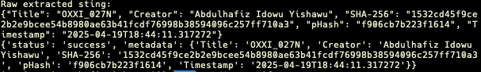

# Cartify

**You’re Cartified.**  
Cartify is a digital authorship and certification system for artists.  
It watches your folder, fingerprints your art, embeds metadata, and certifies your originality — visibly and invisibly.

## Features
- SHA-256 + pHash fingerprinting
- PNG metadata + invisible steganographic embedding
- PDF + animated GIF certificate generation
- Automatic logging & export structure
- Verifier script for embedded metadata

## Usage
1. Drop your artwork in the `art_exports` folder
2. Let Cartify detect, process, and certify it
3. Extract metadata anytime using `cartify_extract_stego.py`

## Upcoming
- Google Drive uploads
- Web dashboard + public certificate viewer
- Blockchain anchoring + collector edition tracking

## Screenshots

### 1. Cartified Certificate

### 2. Exported Folder Structure

### 3. Metadata Extraction via Terminal

## Author
Hafiz Yishawu (@oats.x)
