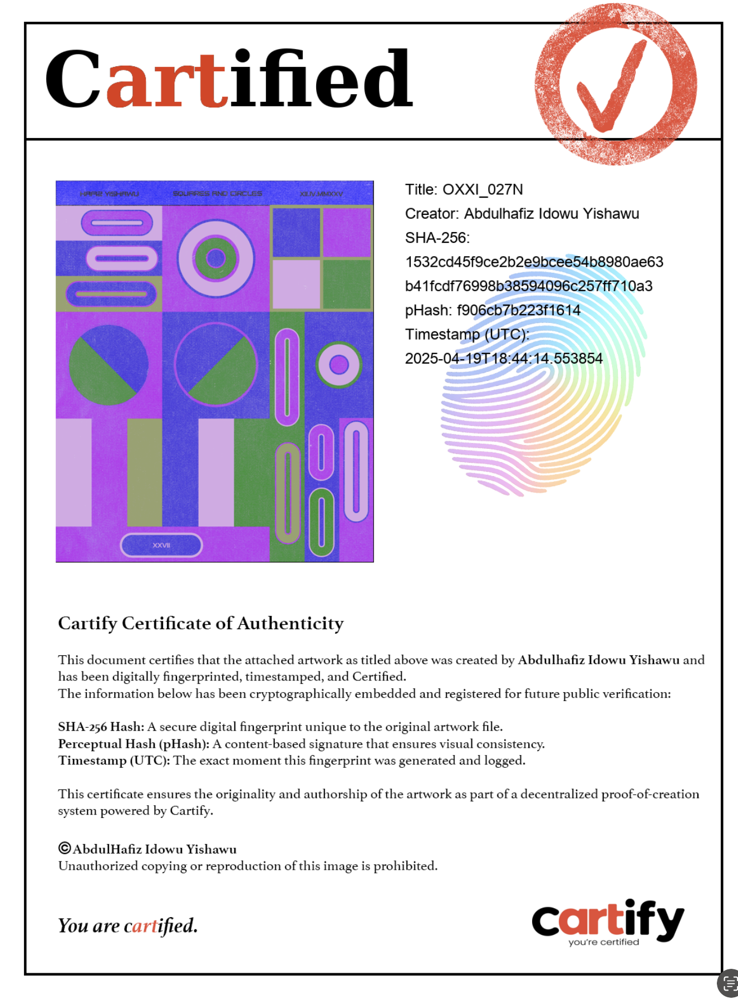
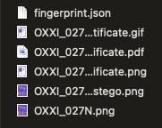
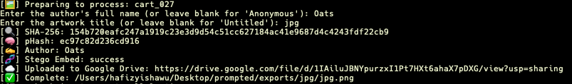
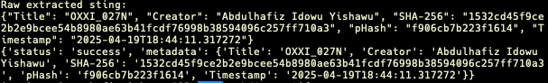

# Cartify

Cartify is a digital authorship and certification system for artists. It fingerprints your artwork, embeds metadata, certifies your originality (visibly and invisibly), and automatically uploads the certified bundle to your Google Drive.

---

## Features

- Folder watching for incoming artworks
- SHA-256 + pHash fingerprinting
- Metadata embedding + steganographic hiding
- Poster-style certificate (PNG, PDF, GIF)
- Exported ZIP bundle for each certified art
- Google Drive upload with sharable link
- Local logging of certifications
- Automatically moves processed originals to a subfolder to prevent duplicates

---

## Installation

1. **Clone the repository:**
   ```bash
   git clone https://github.com/YourUsername/cartify.git
   cd cartify
   ```

2. **Create and activate a virtual environment (optional but recommended):**
   ```bash
   python -m venv oxxi-env
   source oxxi-env/bin/activate  # macOS/Linux
   .\oxxi-env\Scripts\activate  # Windows
   ```

3. **Install dependencies:**
   ```bash
   pip install -r requirements.txt
   ```

---

## First-Time Setup

When you run Cartify for the first time, it will:

1. Prompt you to enter the full path of the folder to watch for artworks.
2. Automatically create an `exports` and `originals` folder within it.
3. Save your configuration in `config.json`.

> Each time you drop a file prefixed with `CART_` (e.g., `CART_MyArtwork.jpg`), the app will trigger processing.

---

## Authentication for Google Drive

On first upload, Cartify will open a browser window asking you to authenticate with Google.

You’ll grant access to your Drive (only for uploading certified bundles). A `token.json` file will be created — this is unique to you and **should not be committed** to version control.

---

## Usage

```bash
python cartify_watcher_2.0.3.py
```

When a valid file is detected:
- You'll be prompted to input the author's name and artwork title.
- A certification bundle will be created and uploaded to your Drive.
- Log entries will be stored in `fingerprint_log.csv`.
- Processed originals are moved to `/originals` subfolder.

---

## Notes

- Only files prefixed with `CART_` will trigger processing.
- Supported image types: `.png`, `.jpg`, `.jpeg`, `.bmp`, `.gif`, `.tiff`, `.webp`, `.jfif`, `.pjpeg`, `.pjp`
- `config.json` and `token.json` are automatically created per user.
- Keep your `credentials.json` safe and private (used to allow OAuth via Google Cloud).
- Processed files are moved to the `originals` subfolder to prevent reprocessing.

---

## License

MIT License — Free to use, modify, and distribute.

### Certificate Preview


### Folder Structure Output


### Google Drive Upload Confirmation


### Metadata Extraction Output
