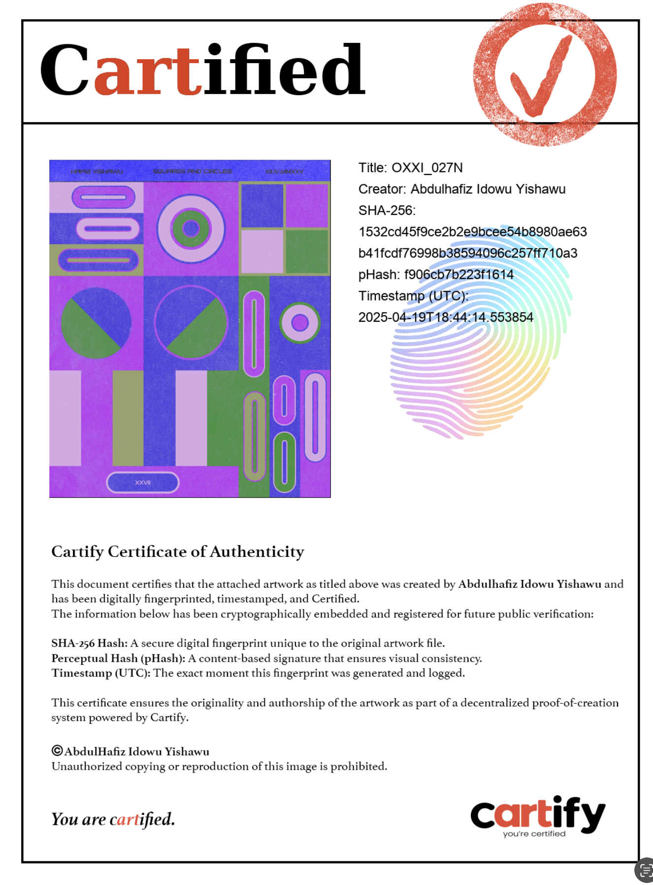
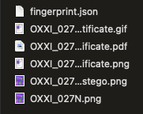
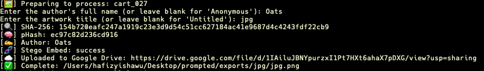
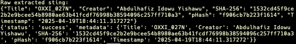

# Cartify

Cartify is a digital authorship and certification system for artists. It fingerprints your artwork, embeds metadata, certifies your originality (visibly and invisibly), and automatically uploads the certified bundle to your Google Drive.

---

## Where this is going: Certifiles

Cartify is the working prototype for **Certifiles**, an authorship and provenance service
for any digital file rather than artwork alone. The pipeline below stays as it is; what
changes is where its output goes. Cartify's fingerprinting becomes the client that
produces records, and those records are entered into a public append-only transparency
log that anyone can verify without trusting the operator.

Two limits are stated deliberately, because the design depends on them:

- **A hash proves integrity and time, not authorship.** Registration proves who
  registered a file, not who created it.
- **This cannot detect AI-generated content.** It is a positive-attestation system. A
  record says a declared identity claimed a file at a point in time. The absence of a
  record proves nothing at all.

The design is written down before it is built:

| Document | Covers |
|---|---|
| [Threat model](docs/architecture/threat-model-registration.md) | Registration and verification, eight threats, and the controls that make each structurally hard rather than merely detectable |
| [ADR 0001: Witness policy](docs/decisions/0001-witness-policy.md) | Staged K-of-N witness quorum, policy versioning, and the six verifier outcomes |

Three decisions in there cannot be retrofitted once production records exist: record
validity is defined as log inclusion rather than a valid signature, external witnessing
must precede the first record, and the record schema carries identity fields from version
one.

---

## Transparency log core

`certifiles/` holds the log primitives. Standard library only — nothing in
`requirements.txt` is needed to run or test this part.

- `certifiles/merkle.py` — RFC 6962 tree hashing, inclusion and consistency proofs, and
  both verification routines. Consistency verification is what a witness runs before
  cosigning a tree head.
- `certifiles/record.py` — the record entered into the log, with canonical serialization.
  Identity is an opaque token and there is no self-asserted registration timestamp; both
  are enforced in validation rather than left to convention.

```bash
python3 -m unittest discover -s tests -t .
```

Correctness is cross-validated over every index of every tree size up to 33 in both
directions rather than against copied vectors, because the failure that matters is a
proof that verifies when it should not.

Status: primitives only. There is no server, no signing key, no witness integration and
no verifier CLI yet. RFC 6962's published test vectors should be added before any
production record is issued — the current tests prove the implementation is
self-consistent, not that it is byte-compatible with the specification.

---

## Features

- Folder watching for incoming artworks
- SHA-256 + pHash fingerprinting
- Metadata embedding + steganographic hiding
- Poster-style certificate (PNG, PDF, GIF)
- Exported ZIP bundle for each certified art
- Google Drive upload with sharable link
- Local logging of certifications
- Automatically moves processed originals to a subfolder to prevent duplicates

---

## Installation

1. **Clone the repository:**
   ```bash
   git clone https://github.com/Hafizyishawu/cartify.git
   cd cartify
   ```

2. **Create and activate a virtual environment (optional but recommended):**
   ```bash
   python -m venv cartify
   source cartify/bin/activate  # macOS/Linux
   .\cartify\Scripts\activate  # Windows
   ```

3. **Install dependencies:**
   ```bash
   pip install -r requirements.txt
   ```

---

## First-Time Setup

When you run Cartify for the first time, it will:

1. Prompt you to enter the full path of the folder to watch for artworks.
2. Automatically create an `exports` and `originals` folder within it.
3. Save your configuration in `config.json`.

> Each time you drop a file prefixed with `CART_` (e.g., `CART_MyArtwork.jpg`), the app will trigger processing.


---

## Google Cloud Credentials Setup

To enable Google Drive upload, you need to generate your own OAuth credentials from Google Cloud:

1. Go to [Google Cloud Console](https://console.cloud.google.com/).
2. Create a new project (or use an existing one).
3. Navigate to **APIs & Services > Credentials**.
4. Click **Create Credentials** > **OAuth client ID**.
5. Choose **Desktop App** as the application type.
6. Download the JSON file and save it as `credentials.json` in the Cartify root directory.

> Do not share or commit your personal `credentials.json` to GitHub. Keep it private.

A `credentials.example.json` file is provided in this repo as a template reference only


---

## Authentication for Google Drive

On first upload, Cartify will open a browser window asking you to authenticate with Google.

You’ll grant access to your Drive (only for uploading certified bundles). A `token.json` file will be created — this is unique to you and **should not be committed** to version control.

---

## Usage

```bash
python cartify_watcher_2.0.3.py
```

When a valid file is detected:
- You'll be prompted to input the author's name and artwork title.
- A certification bundle will be created and uploaded to your Drive.
- Log entries will be stored in `fingerprint_log.csv`.
- Processed originals are moved to `/originals` subfolder.

---

## Notes

- Only files prefixed with `CART_` will trigger processing.
- Supported image types: `.png`, `.jpg`, `.jpeg`, `.bmp`, `.gif`, `.tiff`, `.webp`, `.jfif`, `.pjpeg`, `.pjp`
- `config.json` and `token.json` are automatically created per user.
- Keep your `credentials.json` safe and private (used to allow OAuth via Google Cloud).
- Processed files are moved to the `originals` subfolder to prevent reprocessing.

---

## License

MIT License — Free to use, modify, and distribute.

### Certificate Preview


### Folder Structure Output


### Google Drive Upload Confirmation


### Metadata Extraction Output


---

## Folder Structure Preview

```bash
cartify/
├── cartify_watcher_2.0.3.py
├── cartify_embed_stego.py
├── cartify_extract_stego.py
├── drive_upload.py
├── certifiles/              # transparency log core
│   ├── merkle.py
│   └── record.py
├── tests/
├── docs/
│   ├── architecture/        # threat model
│   └── decisions/           # ADRs
├── template/
├── assets/
├── config.json (auto-generated, git-ignored)
└── token.json (auto-generated, git-ignored)
```

---
